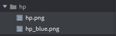
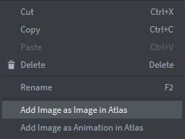
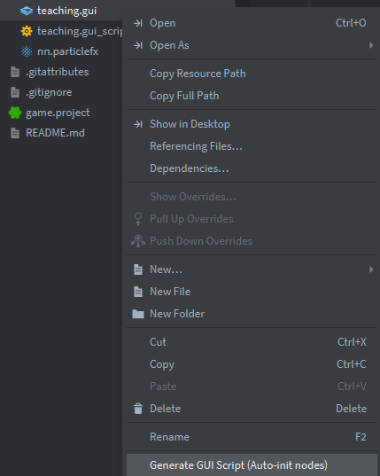
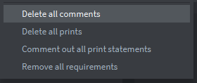

# Defolder Developer Kit

Contains plugins for the Defold Editor that allow certain tasks to be performed automatically.

At the moment, DDK contains some editor scripts:

- [atlas](ddk/editor_scripts/atlas.editor_script)
- [comments_cleaner](ddk/editor_scripts/comments_cleaner.editor_script)
- [init_gui_nodes](ddk/editor_scripts/init_gui_nodes.editor_script)

--- 

Add in `game.project` in section `dependencies`: [releases versions](https://github.com/dprogrb/ddk/releases)

---
## atlas.editor_script
Select an image or a group of images and choose the following option from the context menu: Add image as an image in the Atlas.
Add image as an animation in the Atlas.

Then you need to will write name of atlas.

---
## init_gui_nodes.editor_script

You can create new nodes and use a script to add the uninitialized nodes to the `init` function of the GUI script attached to that GUI scene.
Select an gui scene and choose option from context menu: Generate GUI script (Auto-init nodes)

---
## comments_cleaner.editor_script

Removal of comments and lines starting with `print()` from Lua script files (render, gui, editor, defold).

**WARNING: At present, the removal of multi-line comments is not being applied.**
